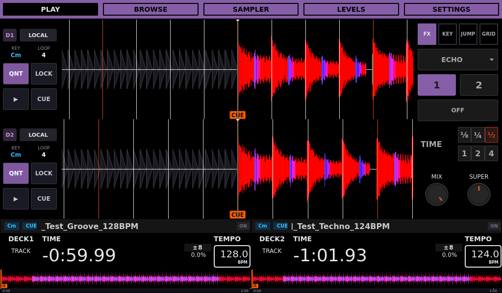
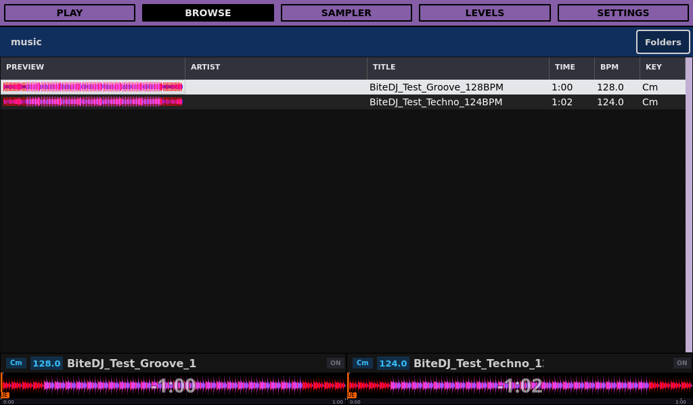

# Custom Bite DJ

<!-- Modified for Custom Bite DJ on 2026-09-09: clarify fork identity and attribution. -->

An independent fork of [BiteDJ by Team Deckshark](https://github.com/TeamDeckshark/bitedj),
which is based on [Mixxx](https://github.com/mixxxdj/mixxx).
This repository is maintained separately; it is not an official Deckshark or Mixxx release.
Report fork-specific issues [here](https://github.com/pablo-feijo/custom-bitedj/issues).

A two-deck DJ appliance for Raspberry Pi, with a **1024×600 touchscreen**,
USB-centered music browsing, and a custom **Pioneer DDJ-400** workflow.
The working integration branch is **`codex/v0.0.7`**.

## Interface previews

**Play** — two decks, scrolling waveforms and FX controls.

[](docs/UI_SCREENSHOTS.md#play)

**Browse** — waveform previews in the library and both deck overviews.

[](docs/UI_SCREENSHOTS.md#browse-preview)

See [all seven Settings screens](docs/UI_SCREENSHOTS.md#settings-general)
in the [0.0.7 UI gallery](docs/UI_SCREENSHOTS.md) and the
[corresponding changelog](CHANGELOG.md#007--unreleased).

## Features

- Compact deck displays, scrolling titles, and Day/Night modes.
- Touch-friendly browsing with saved column layouts and Wayland drag-and-drop.
- Configurable Pad FX with Normal/Shift banks, saved assignments, and independent effect lanes.
- Safer track replacement: **Lock / Fader / Stop / Live**.
- Rekordbox USB waveforms and optional phrase strips, with native analysis fallback.
- A saved Prepare queue and optional return to Play after loading.
- FX, key, beat-jump, linked zoom, and deck presentation controls.
- Appliance settings for audio, display rotation, devices, and system information.

See the [DDJ-400 guide](docs/DDJ400_MAPPING.md) for controls and the
[integration checklist](docs/XSPLOIT_NEXT_BATCH.md) for completed and planned work.

## Build and test

Build the ARM64 application with:

```sh
./scripts/build/docker-build.sh --platform linux/arm64
```

Launch an isolated local GUI/audio test instance with `./scripts/test/run-gui-test.sh`.
Each feature branch uses its own worktree, settings, build, and VNC ports.

- [Repository layout and script locations](docs/REPOSITORY_LAYOUT.md)
- [Build and deploy](docs/BUILD_AND_DEPLOY.md)
- [GUI and audio testing](docs/GUI_TESTING.md)
- [Architecture](docs/INFRASTRUCTURE.md)
- [Changelog](CHANGELOG.md)
- [Change history](docs/DIFFS_FROM_BASE.md)

## Credits

Built on [BiteDJ by Team Deckshark](https://github.com/TeamDeckshark/bitedj)
and [Mixxx](https://github.com/mixxxdj/mixxx). Thank you to Team Deckshark,
[Alyxx](https://github.com/alyxxxinteractive), and their contributors for the foundation.

Special thanks to [xsploit](https://github.com/xsploit/bitedj) for the work behind
our adapted Pad FX, scrolling titles, safer loading, and Rekordbox improvements;
and to [ntamas94 and the Pioneered contributors](https://github.com/ntamas94/pioneered-by-ntamas)
for inspiring our deck indicators, browsing, and waveform controls.

Original notices and contributor history are preserved. See [NOTICE](NOTICE.md)
for attribution and [LICENSE](LICENSE) for the main program's GPL-2.0-or-later
terms. The [BiteDJ skin](res/skins/BiteDJ/LICENSE) carries GPLv3 and its original
Pioneered contributor notices; libraries, fonts and other components retain their
own terms. See [licensing and distribution notes](docs/LICENSING.md).
