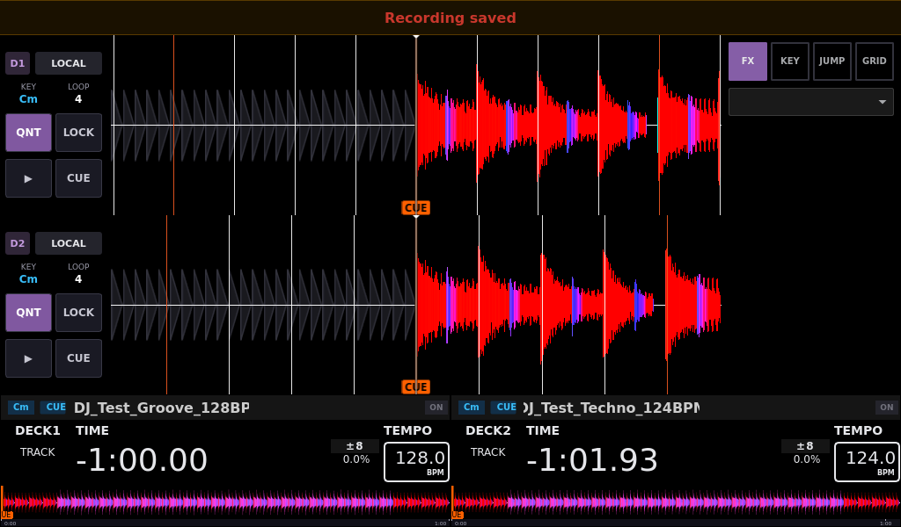

# Recording to USB

In Settings → System, use the drive row’s Record button. Recordings are saved
under `Recordings` on the selected drive. Stop recording and wait for the saved
notification before removing the drive. A forced stop, write failure or lost
recording buffer shows an error; the partial file may be incomplete. A warning
appears when available space falls below 1 GiB. New takes preserve earlier audio
and cue files even when their timestamped names collide.

Synthetic desktop capture at 1024×600, Night theme, verified binary
`0.0.8-codex-v0-0-8-recording-fixes.3`. The notification appears after the encoder
and WAV file close successfully. The standard generated 128 BPM/124 BPM fixtures
are loaded; the capture does not show the Pi or personal tracks.

For regression coverage and hardware checks, see
[recording reliability](TESTING.md#recording-reliability).
