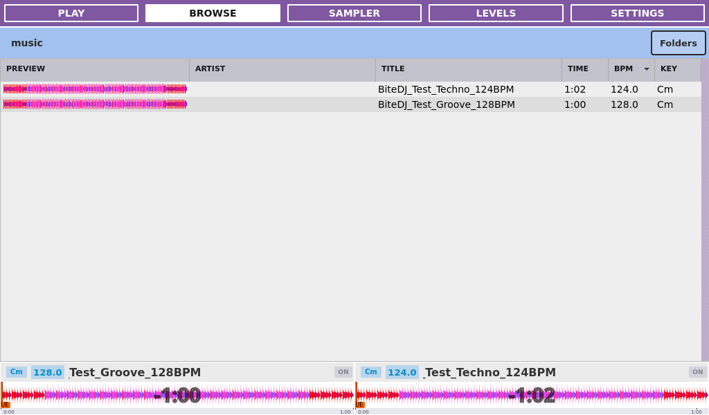
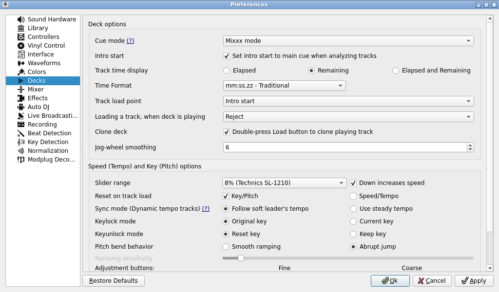

# BiteDJ 0.0.7 UI gallery

<!-- Modified for Custom Bite DJ on 2026-09-09: clarify fork identity and attribution. -->

This guide describes [Custom Bite DJ](../README.md), an independent fork of
[Team Deckshark’s BiteDJ](https://github.com/TeamDeckshark/bitedj), based on Mixxx.

Native **1024×600** screenshots using synthetic music in isolated ARM64 Docker
instances. Play, Beat FX and Browse are refreshed on `codex/browse-fx-touch-ui`
for the compact picker and padded browser controls (verified .8 captures;
unchanged UI in the final .9 SemVer synchronization). Settings and drawer images
come from `codex/waveform-preview-fixes`, binary
`0.0.7-codex-waveform-preview-fixes.2`. The tasks use generated Groove 128 BPM
and Techno 124 BPM fixtures. No physical MIDI controller or USB drive is
attached; runtime statistics describe the container.

See the [0.0.7 changelog](../CHANGELOG.md#007--unreleased) for the changes behind
these screens, or [return to the README](../README.md).

[Drawer](#controller-pad-drawer) | [Play](#play) | [Beat FX picker](#beat-fx-picker) | [Browse with previews](#browse-preview) | [General](#settings-general) | [Library](#settings-library) | [Pad FX](#settings-pad-fx) | [Device](#settings-device) | [Audio](#settings-audio) | [System](#settings-system) | [Info](#settings-info)

## Play

Two loaded decks with synchronized waveform type/palette rendering, deck overviews and the FX panel. The KEY and JUMP tabs share the right-hand panel.

## Beat FX picker

The Standard section follows the 25-name Rekordbox 7 single-mode Beat FX list.
Every entry is a documented [native approximation](BEAT_FX.md), with differences
from Rekordbox explained in the catalogue. Selecting an effect closes the picker
and leaves FX Off until activated. Page navigation and Close preserve selection.

The picker stays inside the right FX panel. Two columns provide 76px-wide
effect buttons with 44px height, 10px labels and a 4px gutter. ECHO is selected
here. Seven rows fit per page; both pages keep the same spacing and long names
wrap inside their cells. Standard, Saved, Clear FX, Close, Prev and Next use
30px controls; the page counter uses 9px text. The counter and arrows sit
immediately below the options, with remaining panel space beneath them.

Day mode and preserved Saved presets

Saved keeps existing preset files and identities. The former duplicate FILTER
labels now display as COLOR FILTER and RHYTHMIC FILTER.

## Browse with previews

Synthetic tracks in the compact library table, with smaller padded headers, the
waveform Preview column enabled, a 44px Folders control and both deck overviews.

Folder navigation uses 44px rows and expansion areas. Tapping a grouping label
expands it; tapping a track folder opens its table.

## Settings — General

Mixer and playback options on the left; waveform, display and cleanup options on the right.

## Settings — Library

Column visibility and relative widths, including the Preview waveform column. ON/OFF toggles visibility independently of the XS, S, M and L width selection.

## Settings — Pad FX

Eight pad selectors and the assignment editor for Normal and Shift banks. This page uses the full Settings area and hides the deck footer.

## Settings — Device

Controller discovery and device configuration. The capture instance has no physical controller attached.

## Settings — Audio

Output routing, latency/quality selection and device rescanning. Devices shown belong to the virtual capture environment.

## Settings — System

USB drives, screen mode and rotation, network shortcuts and appliance actions.

## Settings — Info

Audio and system status. Readings describe the local ARM64 Docker capture instance, not Raspberry Pi performance.

## Controller pad drawer

The padded 150px drawer has independent Previous/Next touch buttons and a 44px
header. Forward order is Hot Cues → Memory → Beat Jump → Pad FX → Beat Loop;
Previous reverses and wraps. Controller mode selection and touch share the same
per-deck display state. Performance pads are legends; Hot Cues and Memory retain
interactive cue pads. [Coordinates and mappings](../AGENTS.md#touch-drawer-navigation-and-padding-1024600).

## Refreshing these images

Follow the [capture and review procedure](GUI_TESTING.md#documentation-screenshots)
and [agent screenshot policy](../AGENTS.md#published-ui-screenshots). Refresh
screens affected by UI changes in the same commit and link their sections from
the changelog. Raw captures remain ignored; only reviewed publication images
are stored here. Preserve this gallery once 0.0.7 is released.

Compact FX actions: eraser = Clear FX, × = Close, left/right chevrons =
Prev/Next. Tooltips and accessible names retain the action labels. Standard
and Saved remain labeled tabs; the 9px page counter reads `1 / 2`.

## Service preferences: Decks

Advanced Settings → Decks adds **Jog-wheel smoothing** after Clone deck.
Default 6; range 1–64 audio callbacks. Lower values respond faster; larger values
smooth pitch-bend movement. Apply changes both decks live. Captured at 1024×600
with the service window maximized, binary `0.0.7-codex-xsploit-jog-beatfx.1`.

