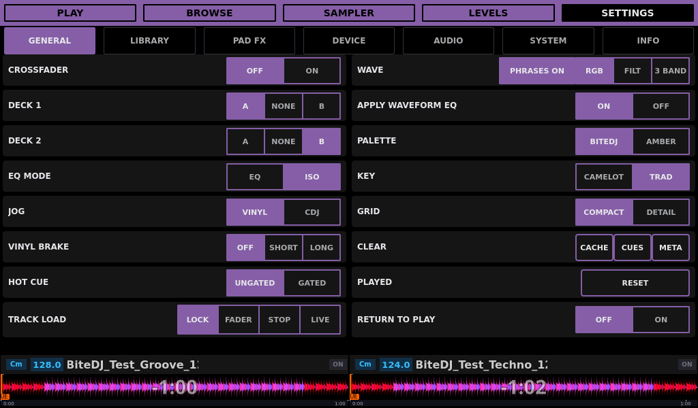
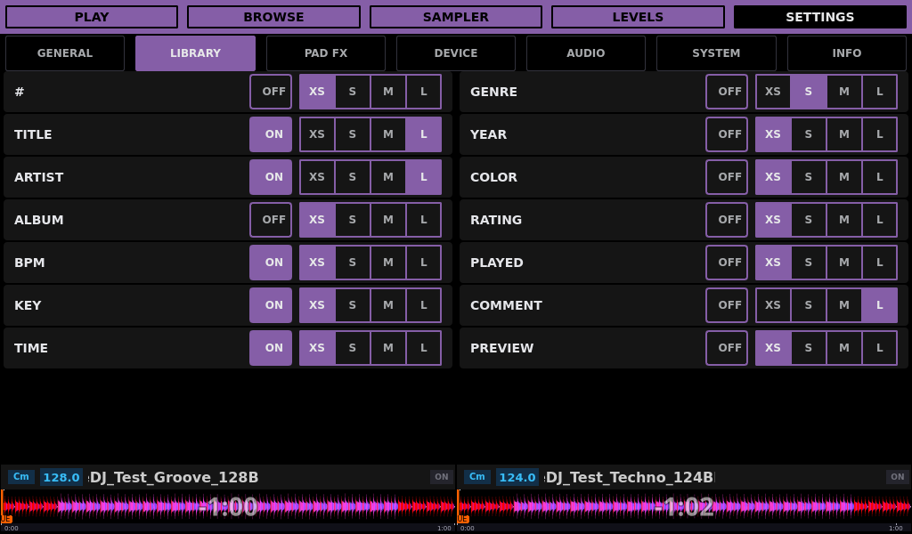
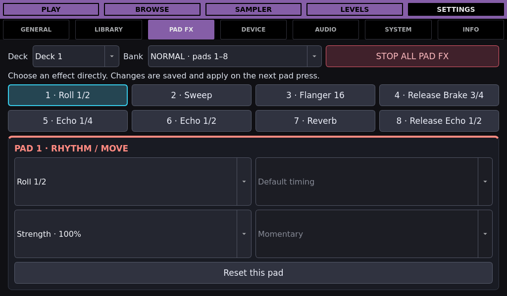
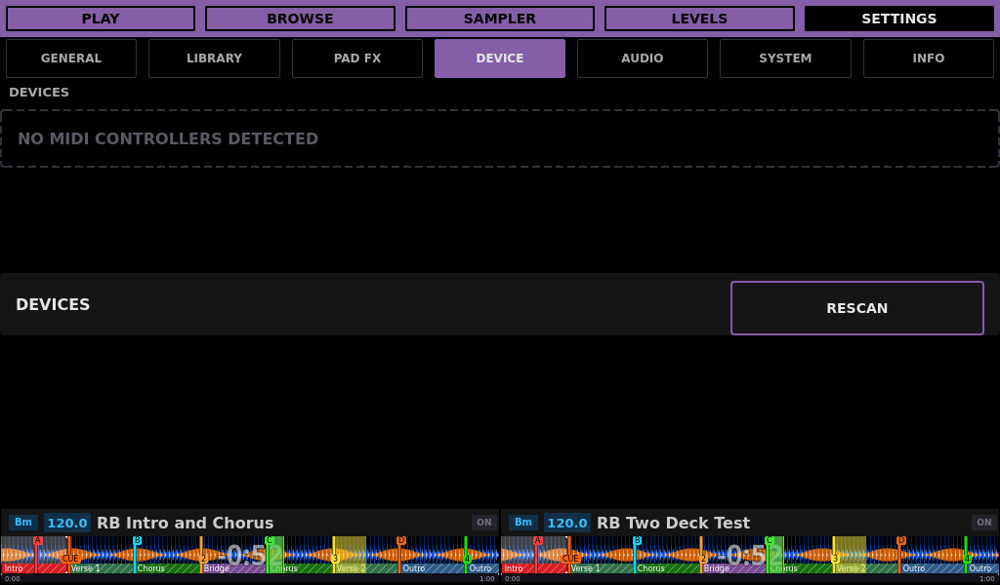
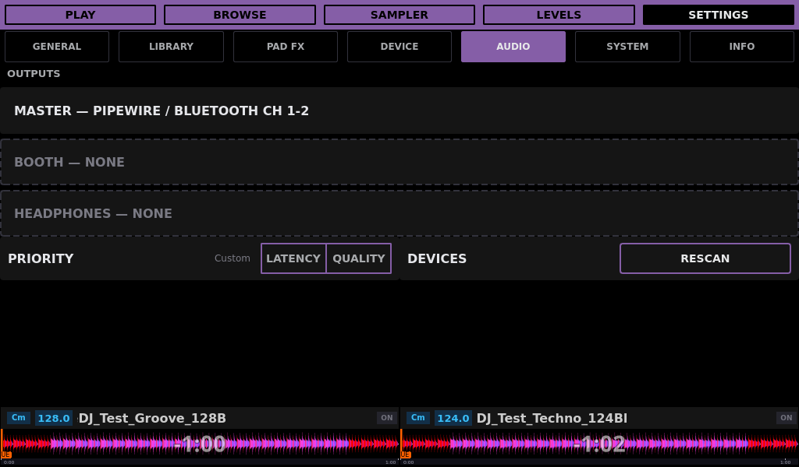
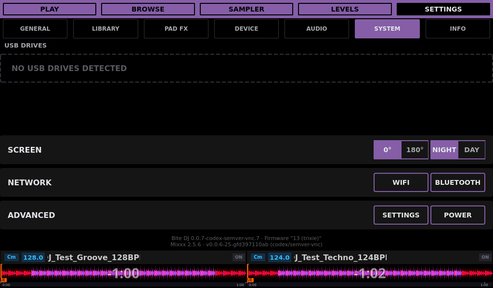
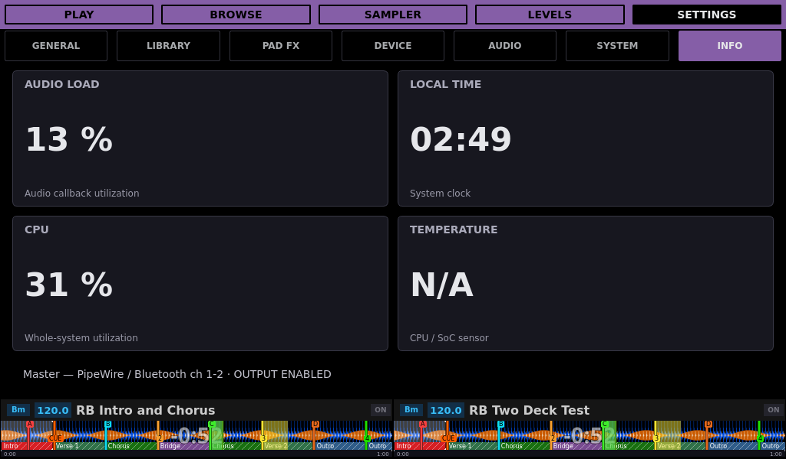

# BiteDJ 0.0.7 UI gallery

<!-- Modified for Custom Bite DJ on 2026-09-09: clarify fork identity and attribution. -->

This guide describes [Custom Bite DJ](../README.md), an independent fork of
[Team Deckshark’s BiteDJ](https://github.com/TeamDeckshark/bitedj), based on Mixxx.

Native **1024×600** screenshots of the 0.0.7 working interface, using synthetic
music in an isolated ARM64 Docker instance and the Night theme.
UI source revision: `8f87aa338f` on `codex/v0.0.7`.
The [synthetic Rekordbox fixture](../tests/rekordbox/README.md) supplies the two
loaded tracks, phrases and cue colors. Its copied export directory is not a
mounted USB drive, so the Play source badges read **OFFLINE**; no physical MIDI
controller or USB drive is attached. The two fallback rows in Browse show LOAD
until their preview data is available.

See the [0.0.7 changelog](../CHANGELOG.md#007--unreleased) for the changes behind
these screens, or [return to the README](../README.md).

[Play](#play) | [Browse with previews](#browse-preview) | [General](#settings-general) | [Library](#settings-library) | [Pad FX](#settings-pad-fx) | [Device](#settings-device) | [Audio](#settings-audio) | [System](#settings-system) | [Info](#settings-info)

## Play

Two loaded decks with scrolling waveforms, deck overviews and the FX panel. The KEY and JUMP tabs share the right-hand panel.

## Browse with previews

Synthetic tracks in the compact library table, with the waveform Preview column enabled and both deck overviews visible below.

## Settings — General

Mixer and playback options on the left; waveform, display and cleanup options on the right.

## Settings — Library

Column visibility and relative widths, including the Preview waveform column. ON/OFF toggles visibility independently of the XS, S, M and L width selection.

## Settings — Pad FX

Eight pad selectors and the assignment editor for Normal and Shift banks. This page uses the full Settings area and hides the deck footer.

## Settings — Device

Controller discovery and device configuration. The capture instance has no physical controller attached.

## Settings — Audio

Output routing, latency/quality selection and device rescanning. Devices shown belong to the virtual capture environment.

## Settings — System

USB drives, screen mode and rotation, network shortcuts and appliance actions.

## Settings — Info

Audio and system status. Readings describe the local ARM64 Docker capture instance, not Raspberry Pi performance.

## Refreshing these images

Follow the [capture and review procedure](GUI_TESTING.md#documentation-screenshots)
and [agent screenshot policy](../AGENTS.md#published-ui-screenshots). Refresh
screens affected by UI changes in the same commit and link their sections from
the changelog. Raw captures remain ignored; only reviewed publication images
are stored here. Preserve this gallery once 0.0.7 is released.
