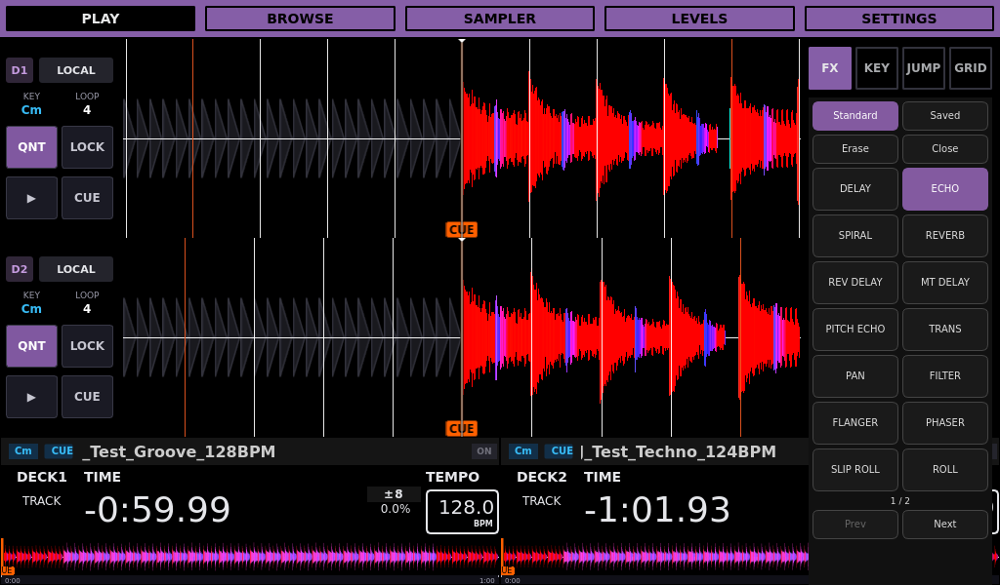
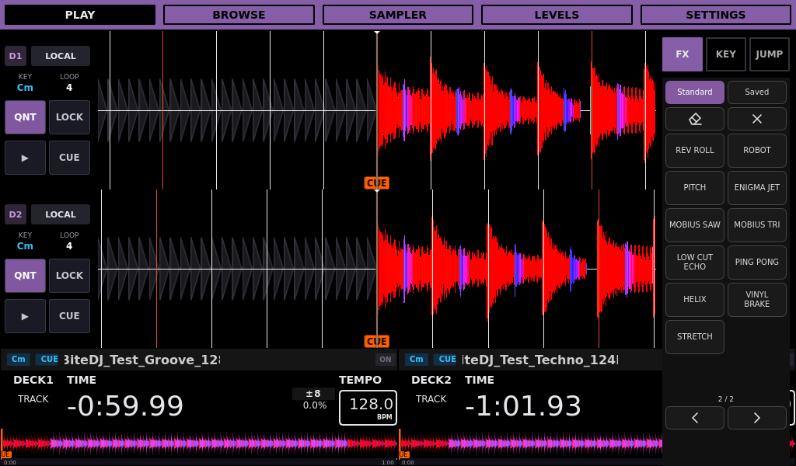
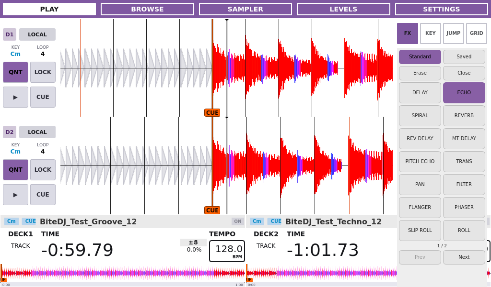
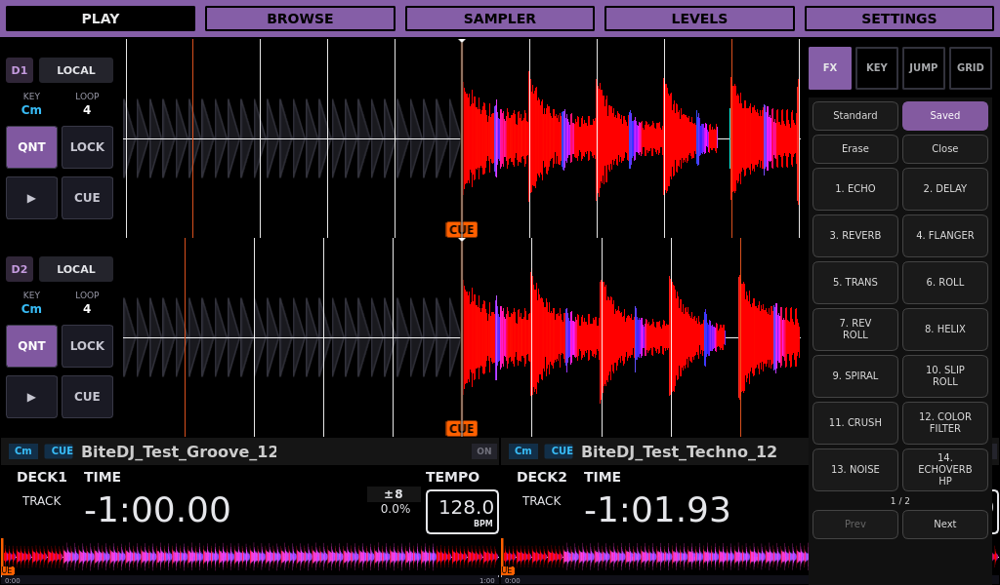
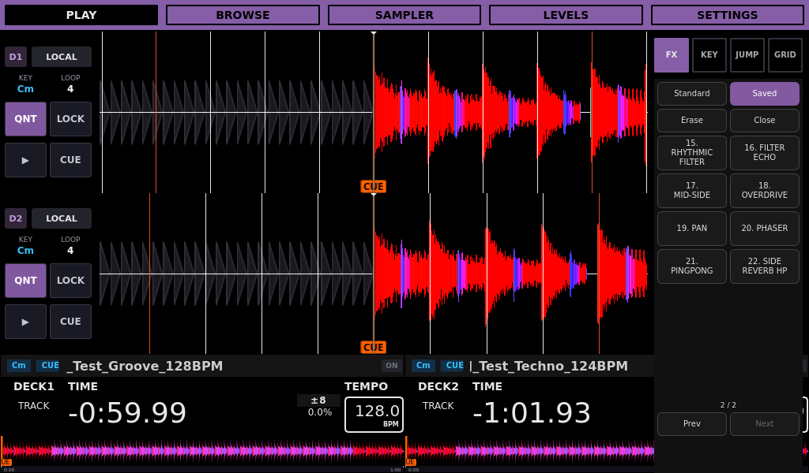
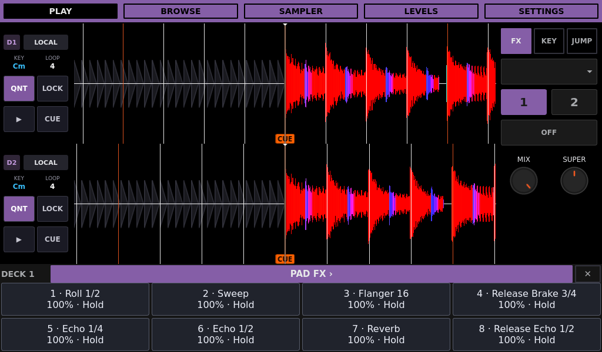
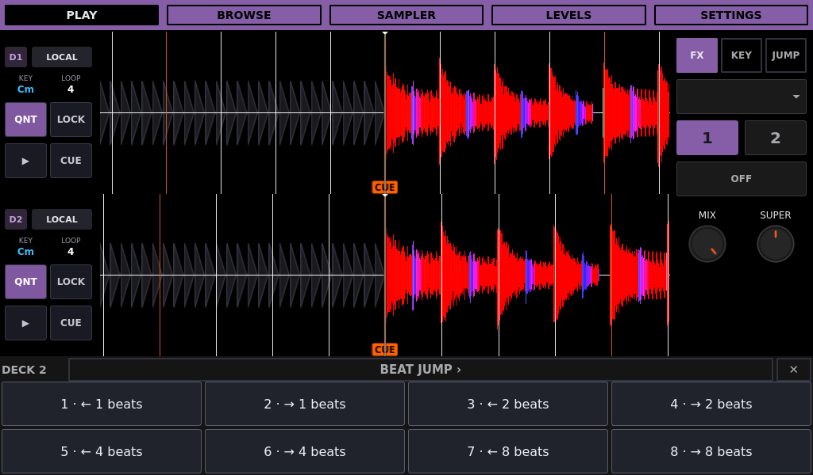
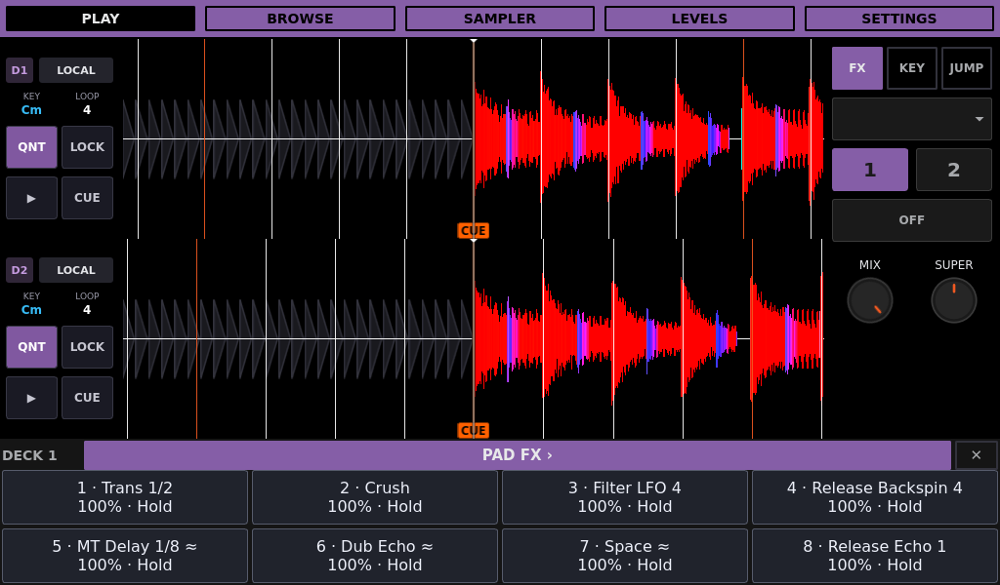
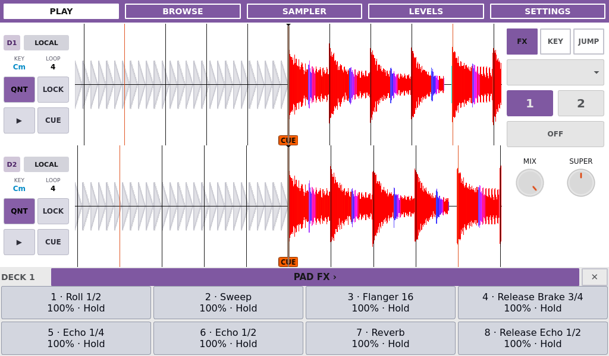
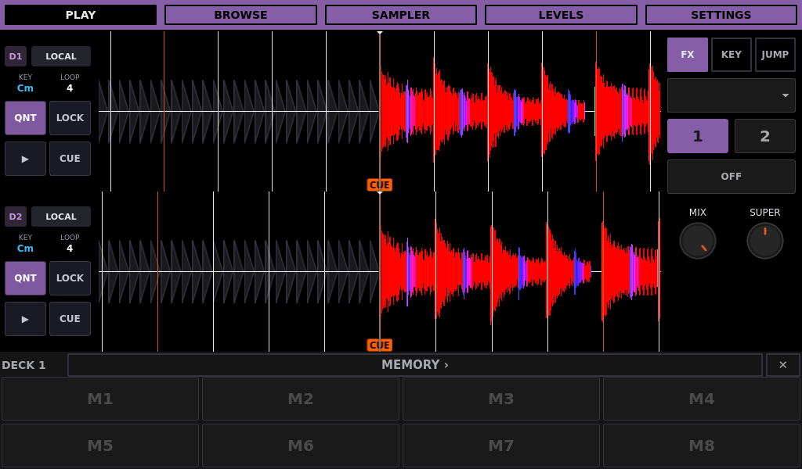

# BiteDJ 0.0.7 UI gallery

<!-- Modified for Custom Bite DJ on 2026-09-09: clarify fork identity and attribution. -->

This guide describes [Custom Bite DJ](../README.md), an independent fork of
[Team Deckshark’s BiteDJ](https://github.com/TeamDeckshark/bitedj), based on Mixxx.

Native **1024×600** screenshots using synthetic music in isolated ARM64 Docker
instances. Play and Beat FX were refreshed on `codex/ddj400-shift-fx-back` for
the catalogue and picker changes documented here; they use the generated Groove
128 BPM and Techno 124 BPM tracks. The picker is shown in Night and Day modes.

Browse and Settings retain UI source revision `8f87aa338f` on `codex/v0.0.7`,
in Night mode. Their [synthetic Rekordbox fixture](../tests/rekordbox/README.md)
supplies tracks, phrases and cue colors. Its copied export directory is not a
mounted USB drive; the source badges read **OFFLINE**. No physical MIDI controller
or USB drive is attached. The two fallback Browse rows show LOAD until preview
data is available.

See the [0.0.7 changelog](../CHANGELOG.md#007--unreleased) for the changes behind
these screens, or [return to the README](../README.md).

[Play](#play) | [Beat FX picker](#beat-fx-picker) | [Browse with previews](#browse-preview) | [General](#settings-general) | [Library](#settings-library) | [Pad FX](#settings-pad-fx) | [Device](#settings-device) | [Audio](#settings-audio) | [System](#settings-system) | [Info](#settings-info)

## Play

Two loaded decks with scrolling waveforms, deck overviews and the FX panel. The KEY and JUMP tabs share the right-hand panel.

## Beat FX picker

The Standard section follows the 25-name Rekordbox 7 single-mode Beat FX list.
Every entry is a documented [native approximation](BEAT_FX.md), with differences
from Rekordbox explained in the catalogue. Selecting an effect closes the picker
and leaves FX Off until activated. Page navigation and Close preserve selection.

Two columns provide 492px-wide effect buttons with at least 50px height and an
8px gutter. ECHO is selected here. The second page keeps the same row spacing.

Day mode and preserved Saved presets

Saved keeps existing preset files and identities. The former duplicate FILTER
labels now display as COLOR FILTER and RHYTHMIC FILTER.

## Browse with previews

Synthetic tracks in the compact library table, with the waveform Preview column enabled and both deck overviews visible below.

## Settings — General

Mixer and playback options on the left; waveform, display and cleanup options on the right.

## Settings — Library

Column visibility and relative widths, including the Preview waveform column. ON/OFF toggles visibility independently of the XS, S, M and L width selection.

## Settings — Pad FX

Eight pad selectors and the assignment editor for Normal and Shift banks. This page uses the full Settings area and hides the deck footer.

## Settings — Device

Controller discovery and device configuration. The capture instance has no physical controller attached.

## Settings — Audio

Output routing, latency/quality selection and device rescanning. Devices shown belong to the virtual capture environment.

## Settings — System

USB drives, screen mode and rotation, network shortcuts and appliance actions.

## Settings — Info

Audio and system status. Readings describe the local ARM64 Docker capture instance, not Raspberry Pi performance.

## Refreshing these images

Follow the [capture and review procedure](GUI_TESTING.md#documentation-screenshots)
and [agent screenshot policy](../AGENTS.md#published-ui-screenshots). Refresh
screens affected by UI changes in the same commit and link their sections from
the changelog. Raw captures remain ignored; only reviewed publication images
are stored here. Preserve this gallery once 0.0.7 is released.

## Controller pad drawer

Branch `codex/controller-pad-drawer`, based on `559edc3def`; compiled version
`0.0.7-codex-controller-pad-drawer.2`. Captured at 1024×600 with synthetic music
and the actual DDJ-400 mapping receiving simulated MIDI, not physical hardware.
The legend occupies the existing cue drawer, follows each deck's selected mode
and shows the current saved assignments. Use the controller pads to perform;
the new legend cells are read-only. The touch header cycles Hot Cues → Memory →
Beat Jump → Pad FX → Beat Loop. Hot Cue restores the existing touch controls.

