# Custom Bite DJ 0.0.8 UI gallery

Custom Bite DJ is an independent fork of Team Deckshark’s BiteDJ, based on Mixxx.
These captures (Night mode unless noted) use synthetic fixtures in owned ARM64
test instances. [Foundational capture provenance](images/ui/0.0.8/capture-provenance.json)
and [small-fixes capture provenance](images/ui/0.0.8/small-fixes-capture-provenance.json)
record the exact build snapshots and image hashes. [Capture procedure](GUI_TESTING.md#documentation-screenshots).
The released [0.0.7 gallery](UI_SCREENSHOTS.md) preserves the remaining unchanged pages.

## Play

Both decks start with Quantize enabled. Shift + jog adjusts the beat grid only
while the right-panel Grid tab is active. The loaded synthetic decks retain
exported Rekordbox RGB colors and phrase markers. RGB uses PWV4/PWV5 colors;
3 Band uses the independent PWV6/PWV7 band envelopes.
Quantize/Lock are separated from Play/Cue by a deliberate safety gap, and long
deck titles now wrap as a continuous marquee instead of snapping to the start.

The Raspberry Pi Touch Display 2 capture below uses its rotated 1280x720
landscape canvas at 1.20 UI scale. Fonts, native menus and logical 44px touch
targets grow together (to about 53 physical pixels), while waveforms consume
the remaining width and the FX panel stays right-aligned. The original 1024x600
profile remains at 1.00.

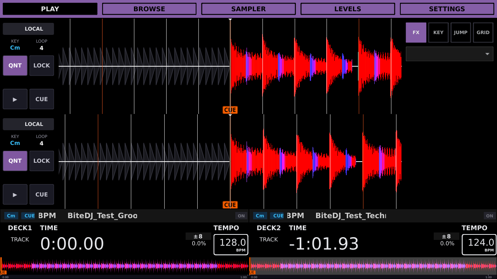

[Small-fixes capture provenance](images/ui/0.0.8/small-fixes-capture-provenance.json)
records the ARM64 binary, 1.20 scale profile and exact image hash.

### Training mode

Training mode removes only the stacked scrolling waveforms while retaining the
bottom-deck overview waves, track time, pitch rate/range and absolute bar
position. The phase view uses either the older CDJ Type 1 amber/blue beat grids
scrolling under a fixed white playhead, with small beat ticks and red
downbeats, or Type 2 with exactly four beat boxes per deck. BPM readouts—including
deck previews on other pages—show `?.?` and reveal the value only while held.

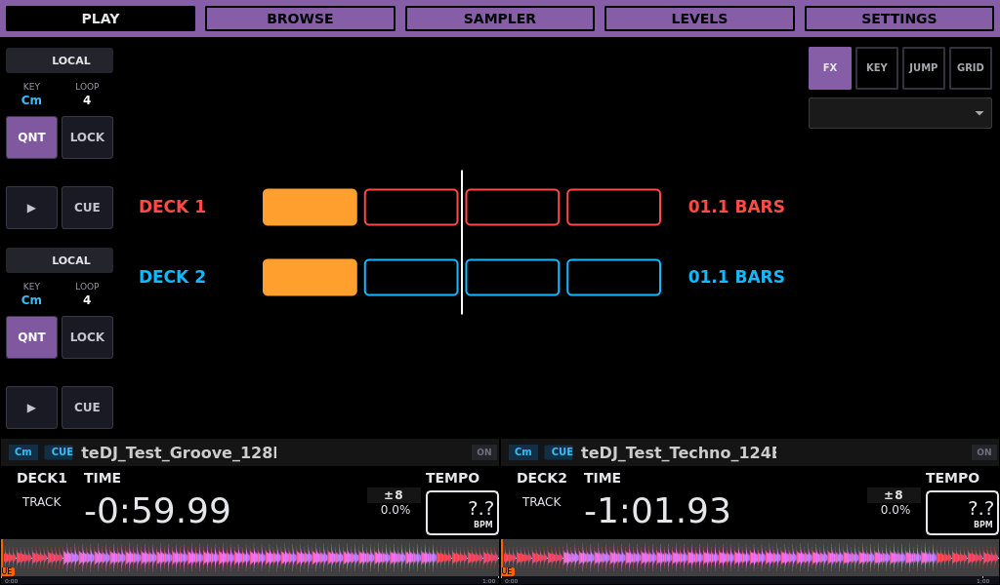

The Line capture uses `0.0.8-codex-training-mode.3` with synchronized audio/frame
timing and bounded synchronous phase painting; [timing capture provenance](images/ui/0.0.8/training-line-timing-provenance.json)
records the replacement image and video measurements.

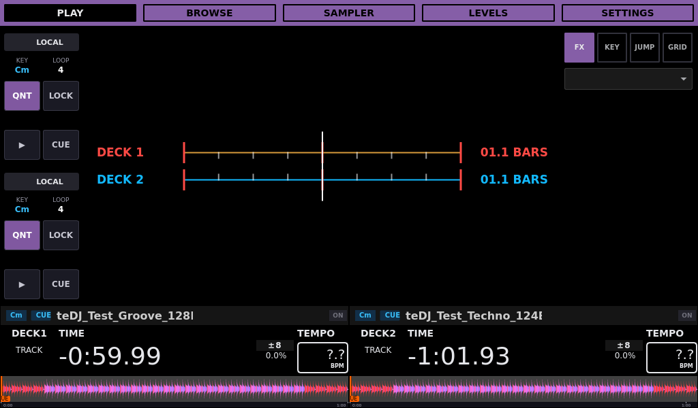

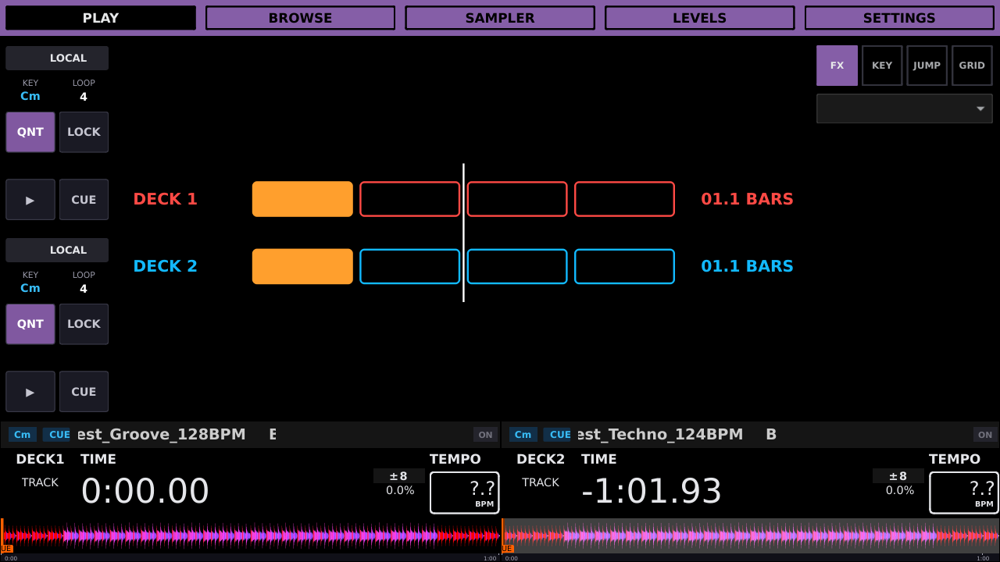

[Small-fixes capture provenance](images/ui/0.0.8/small-fixes-capture-provenance.json)
records both refreshed geometries, the branch-specific binary and exact skin hashes.

### Independent deck time display

Each deck's Elapsed/Remaining selector now changes the numeric readout and its
compact overview together. Elapsed shades the played left side and uses a
positive watermark; Remaining shades the unplayed right side and uses a
negative watermark.

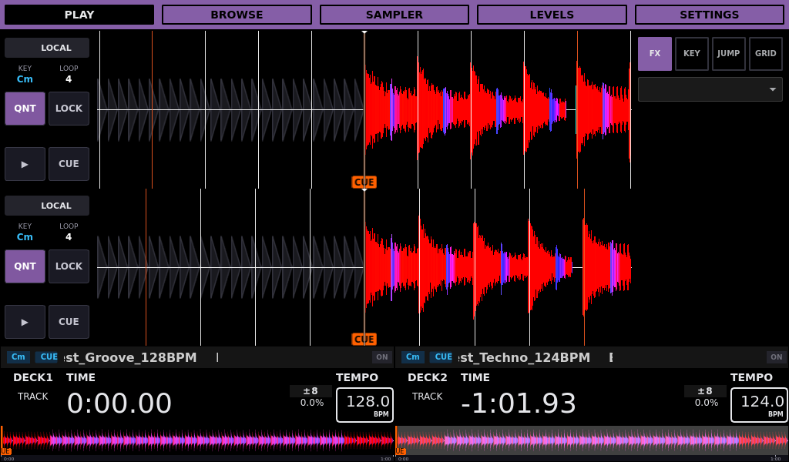

The same profile keeps the contained Beat FX picker readable and aligned, and
uses the additional height for larger System actions without changing saved
tab/control IDs.

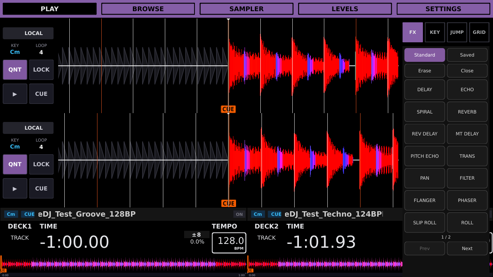

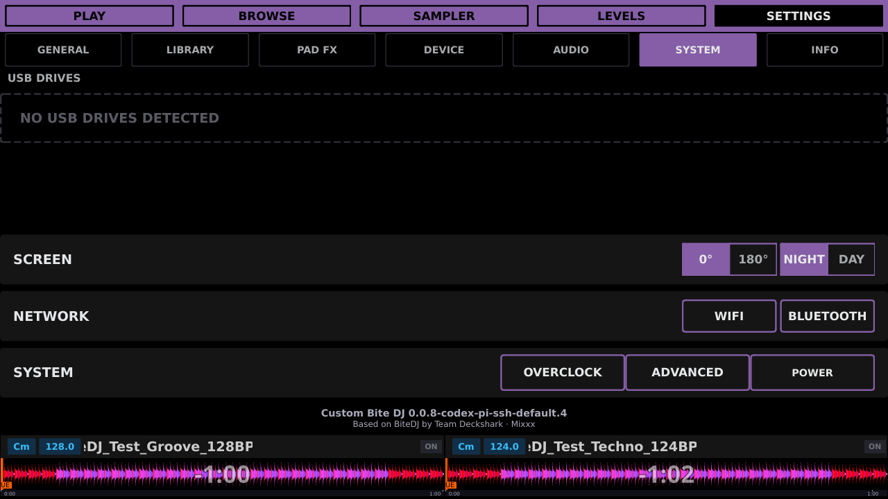

## Browse preview

The first two rows show exported overview waveforms without requiring native
analysis. Their loaded deck overviews keep the same exported colors. The last
two fixtures deliberately lack valid exports; dashes remain until a native
summary becomes available. Preview reads run on a bounded background worker and open filesystem caches read-only.

## Settings General and Library

Vinyl Brake Off, Short and Long retain their saved controls. Normal jog release
uses the selected native ramp; Long and Return to Play On are selected here.
The first page host is prepared during skin setup, and Return to Play reuses
an unchanged waveform layout after the loaded track’s widget updates.

The balanced General columns use one Training Off/Line/Boxes selector and place
Track Load opposite the playback controls.
Library keeps equal seven-row column blocks, then places Grid and Played in a
shared action row with a full-width Clear Library Data row beneath it.

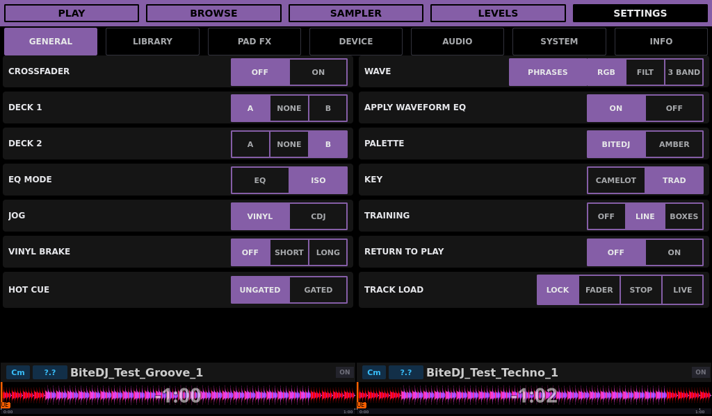

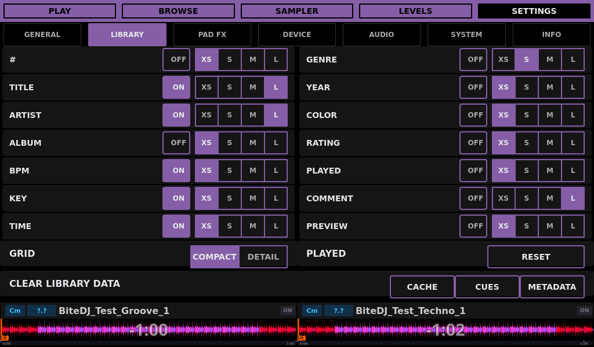

See [controller mappings](DDJ400_MAPPING.md), [release notes](../RELEASE_0.0.8.md)
and the [0.0.8 changelog](../CHANGELOG.md#008--unreleased).

## Settings — Info

The Local Time card forwards touchscreen taps on its labels to the date/time
editor. The footer now includes a large SSH remote-access control whose
fullscreen panel reports the service state and offers Enable/Disable/Back.
Native touch press/release regression coverage verifies both child controls.

These captures use ARM64 build `0.0.8-codex-pi-ssh-default.5`; exact hashes and
capture geometry are in the [SSH access provenance](images/ui/0.0.8/ssh-access-capture-provenance.json).

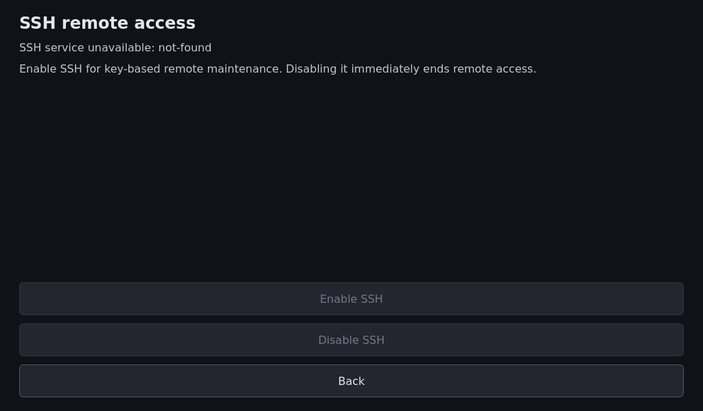

Touch Display 2 at 1280×720 / 1.20

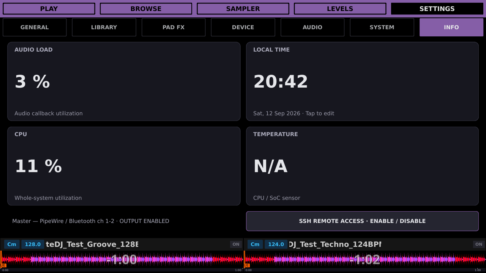

Info and clock in Day mode

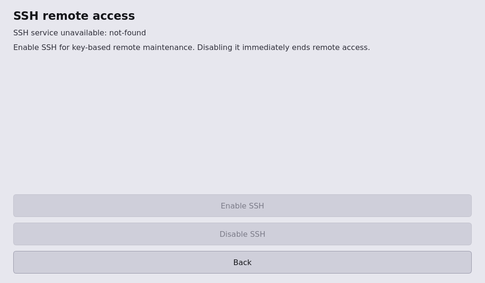

## Recording

See the [recording verification and saved-take capture](RECORDING.md) for the
recording task’s component validation. The combined two-WAV, Preview and recording performance results are documented
in the [release notes](../RELEASE_0.0.8.md#validation-and-artifacts).

A fixed slot beside a source name shows a red dot only when that USB is
receiving the recording. When neither deck uses the recording USB, the
top-right dot appears. Stopping clears all recording dots while playback
continues; source labels and waveform geometry stay unchanged. The former red
playback arrows beside track titles are removed.

The synthetic decks use TestUSB while this take is written to the local
recording directory, so the top-right fallback is shown. The source badges
keep their tiny USB icons and wider names without D1/D2 labels.

