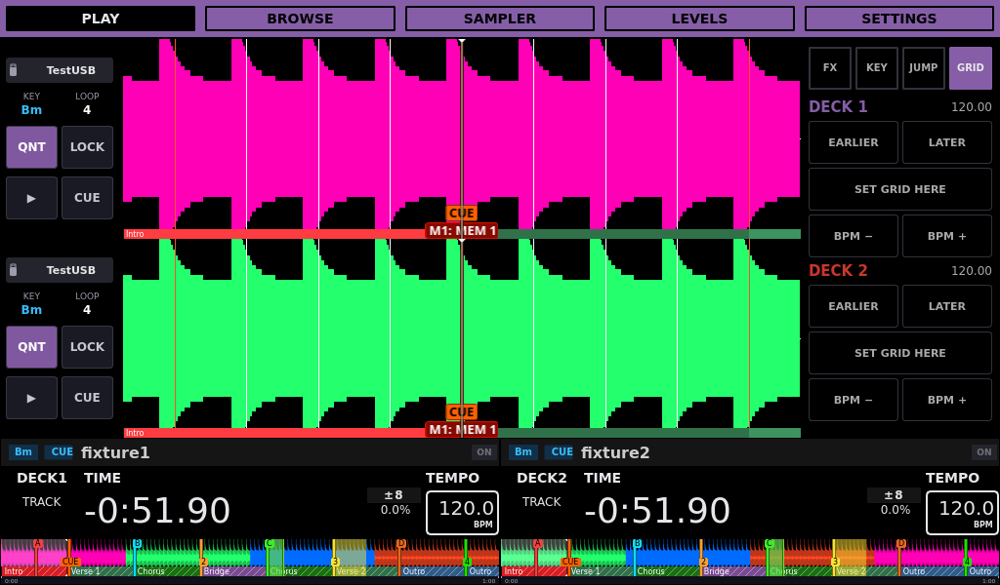
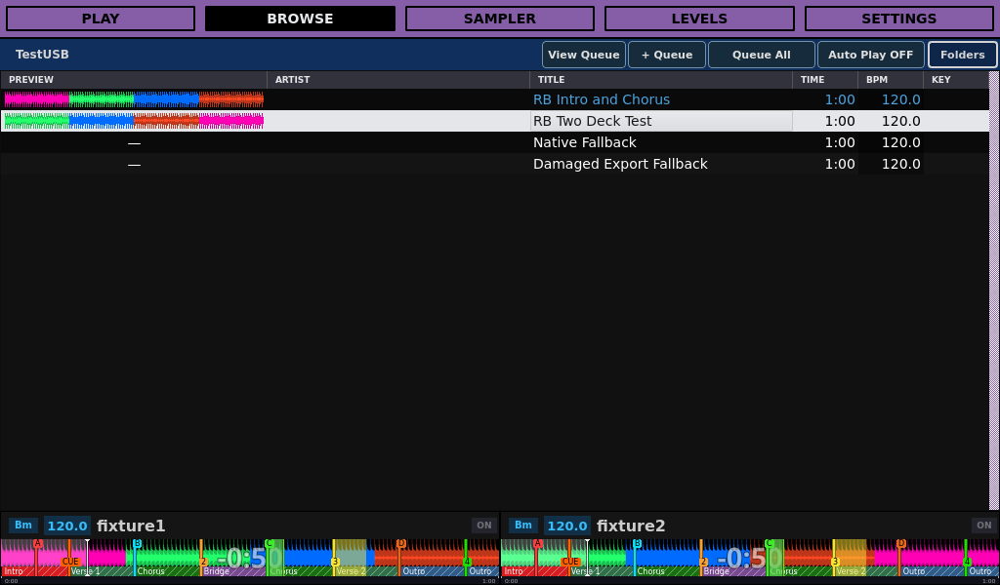
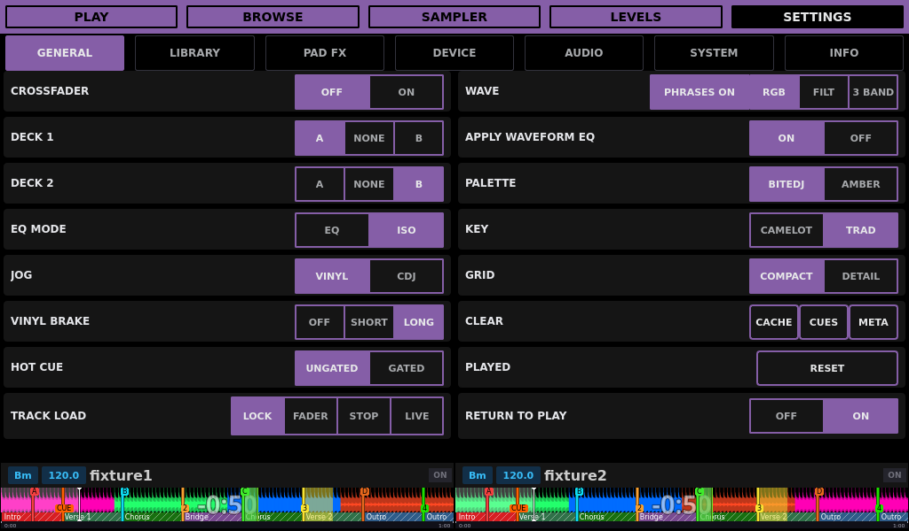
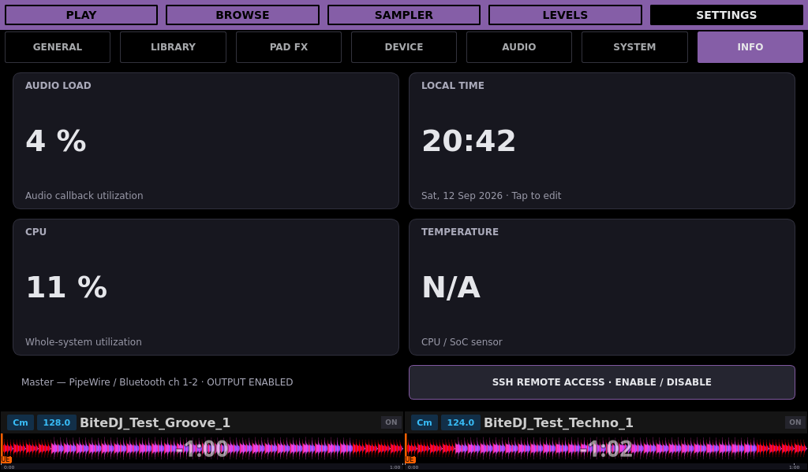
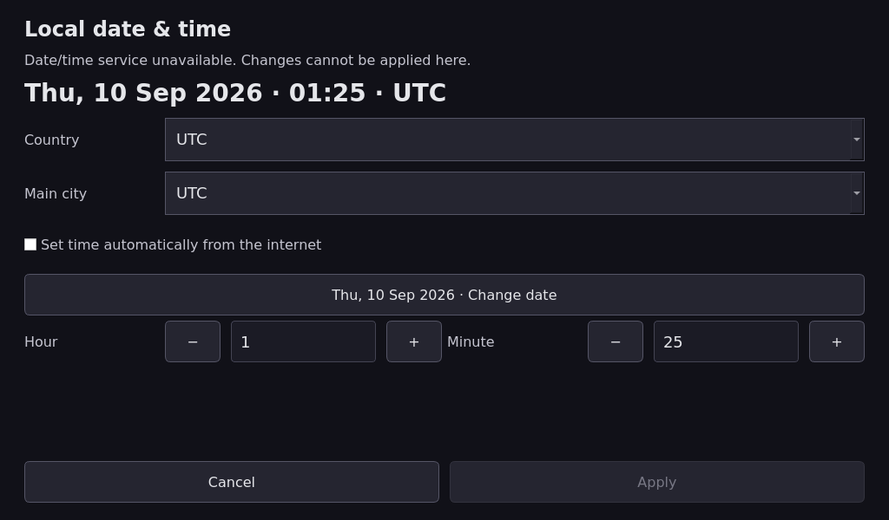
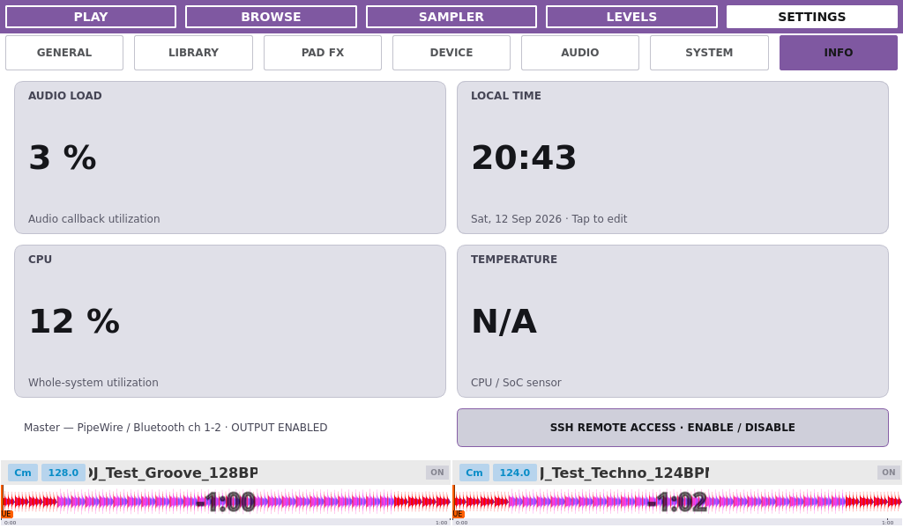
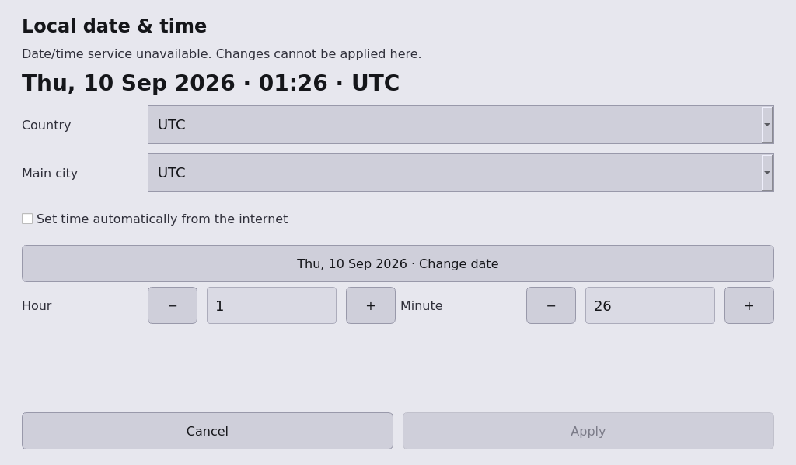
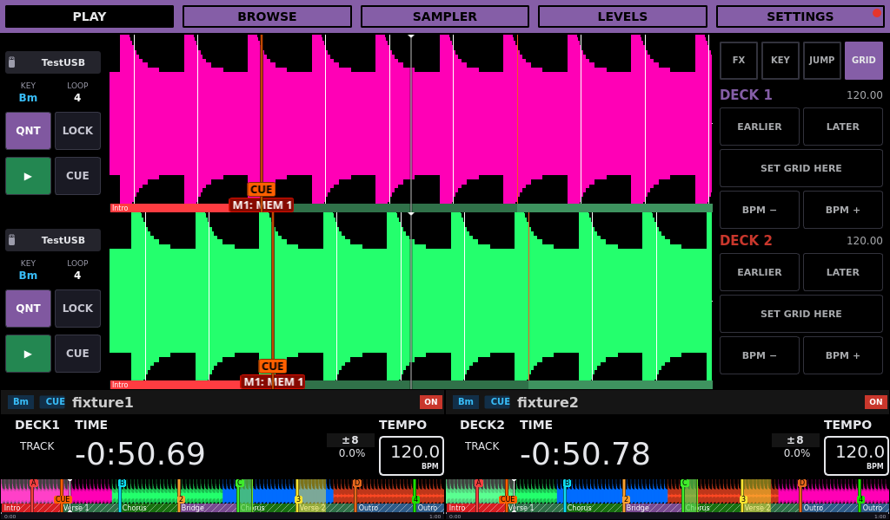
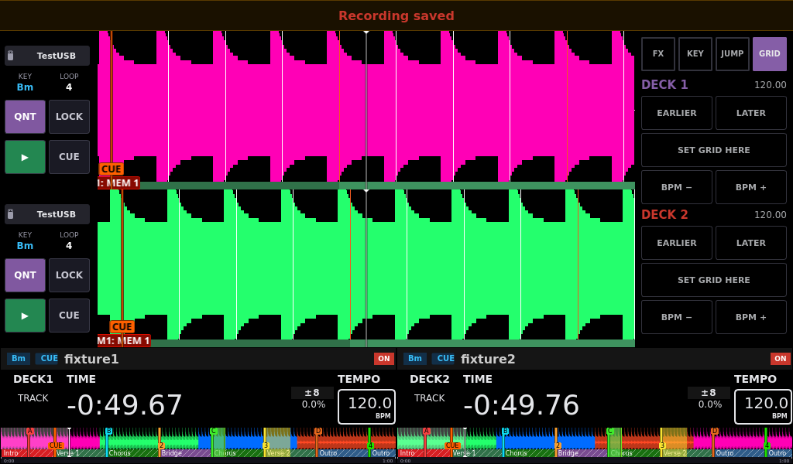
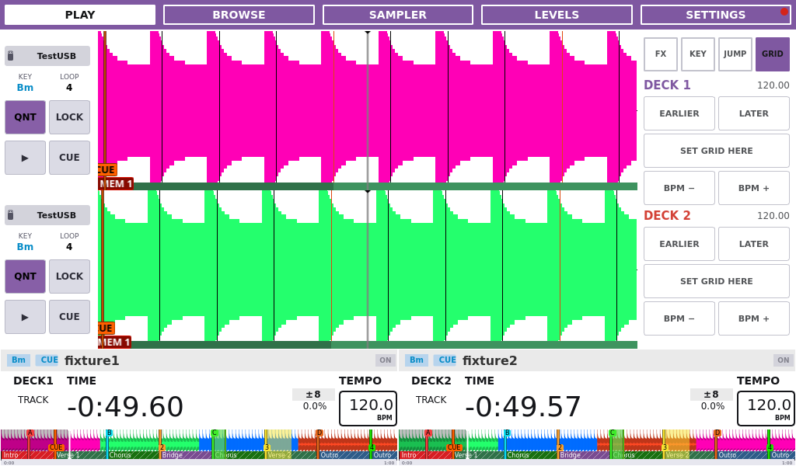

# Custom Bite DJ 0.0.8 UI gallery

Custom Bite DJ is an independent fork of Team Deckshark’s BiteDJ, based on Mixxx.
These 1024×600 captures (Night mode unless noted) use synthetic Rekordbox fixtures and binary
`0.0.8-codex-v0-0-8-controller-validation.7` in an owned ARM64 test instance.
[Capture provenance](images/ui/0.0.8/capture-provenance.json) records the exact
build source snapshot and image hashes. [Capture procedure](GUI_TESTING.md#documentation-screenshots).
The released [0.0.7 gallery](UI_SCREENSHOTS.md) preserves the remaining unchanged pages.

## Play

Both decks start with Quantize enabled. Shift + jog adjusts the beat grid only
while the right-panel Grid tab is active. The loaded synthetic decks retain
exported Rekordbox RGB colors and phrase markers. RGB uses PWV4/PWV5 colors;
3 Band uses the independent PWV6/PWV7 band envelopes.

## Browse preview

The first two rows show exported overview waveforms without requiring native
analysis. Their loaded deck overviews keep the same exported colors. The last
two fixtures deliberately lack valid exports; dashes remain until a native
summary becomes available. Preview reads run on a bounded background worker and open filesystem caches read-only.

## Settings General

Vinyl Brake Off, Short and Long retain their saved controls. Normal jog release
uses the selected native ramp; Long and Return to Play On are selected here.
The first page host is prepared during skin setup, and Return to Play reuses
an unchanged waveform layout after the loaded track’s widget updates.

See [controller mappings](DDJ400_MAPPING.md), [release notes](../RELEASE_0.0.8.md)
and the [0.0.8 changelog](../CHANGELOG.md#008--unreleased).

## Settings — Info

The Local Time card forwards touchscreen taps on its labels to the date/time
editor. Native touch press/release regression coverage verifies opening the
editor and cancelling back to the dashboard.

These unchanged-layout reference captures were verified with
`0.0.7-codex-touch-datetime-editor.1` before integration into 0.0.8; they are not
captures of a combined 0.0.8 build. The other gallery captures retain their
controller-build provenance above.

Info and clock in Day mode

## Recording

See the [recording verification and saved-take capture](RECORDING.md) for the
recording task’s component validation. The combined two-WAV, Preview and recording performance results are documented
in the [release notes](../RELEASE_0.0.8.md#validation-and-artifacts).

A fixed slot beside a source name shows a red dot only when that USB is
receiving the recording. When neither deck uses the recording USB, the
top-right dot appears. Stopping clears all recording dots while playback
continues; source labels and waveform geometry stay unchanged. The former red
playback arrows beside track titles are removed.

The synthetic decks use TestUSB while this take is written to the local
recording directory, so the top-right fallback is shown. The source badges
keep their tiny USB icons and wider names without D1/D2 labels.

